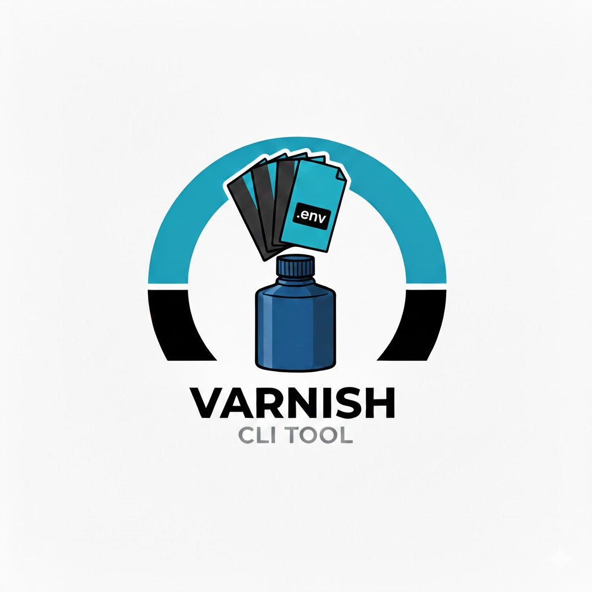

# Varnish

Environment variable manager for projects. Central store for all variables, per-project configs reference what they need.

## The Problem:
When working with different projects I usually have multiple `.env` files scattered around. Remembering which variables go where, keeping them up to date, worrying about a backup so I don't lose them all. I just wanted a light cli tool to manage environment variables for all my projects in one place, and generate `.env` files as needed.

## Usage Case:
- I have a project `myapp` that needs `DATABASE_HOST`, `DATABASE_PORT`, `DATABASE_USER`, `DATABASE_PASSWORD`.
- I have another project `otherapp` that needs `DATABASE_HOST`, `DATABASE_PORT`, but with different values.
- I want to store all these variables in one central place, and generate `.env` files for each project when I need to run them.

> **Note:** Varnish is intended for development use and is not designed for managing production secrets. For production environments, use a dedicated secrets management solution. This is for local convenience only while developing.


## Prerequisites
- Go 1.23+
- Make (for building from source)

## Release Installation

Download the latest binary from the [releases page](https://github.com/lkendrickd/varnish/releases).
Place it in your PATH and make it executable:

```bash
mv varnish-linux-amd64 /usr/local/bin/varnish
chmod +x /usr/local/bin/varnish
export PATH=$PATH:/usr/local/bin
```

## Source Installation

```bash
go install github.com/dk/varnish/cmd/varnish@latest
```

Or build from source:

```bash
make build
```

## Docker

While this tool is primarily intended to be run natively as a cli, you can also use the provided Docker image. For the best experience running the binary is easier than using Docker, but if you prefer containerization, here's how to use it.

Build the image:

```bash
docker build -t varnish .
```

Run commands:

```bash
# Show help
docker run --rm varnish help

# Mount ~/.varnish for store access (use your UID for permissions)
docker run --rm -u $(id -u):$(id -g) \
  -v ~/.varnish:/home/nonroot/.varnish \
  varnish store list

# Mount both store and current directory for full functionality
docker run --rm -u $(id -u):$(id -g) \
  -v ~/.varnish:/home/nonroot/.varnish \
  -v $(pwd):/workspace \
  -w /workspace \
  varnish list
```

For convenience, create an alias:

```bash
alias varnish='docker run --rm -u $(id -u):$(id -g) -v ~/.varnish:/home/nonroot/.varnish -v $(pwd):/workspace -w /workspace varnish'
```

## Quick Start

```bash
# Initialize a project (auto-detects example.env or .env)
cd myproject
varnish init

# This creates .varnish.yaml and imports defaults into the store
# Variables are namespaced by project name (e.g., myproject.database.host)

# Or point to a specific .env file
varnish init --from config.env

# Generate .env file for your project
varnish env

# Load into your shell
set -a && source .env && set +a
```

## Project Namespacing

Variables are namespaced by project name. When you run `varnish init` in a directory called `myapp`, variables are stored with the `myapp.` prefix:

```
myapp.database.host = localhost
myapp.database.port = 5432
myapp.log.level = debug
```

This lets multiple projects share the same store without conflicts.

### Manual Store Management

```bash
# Add variables for a specific project
varnish store set database.host localhost --project myapp
varnish store set database.port 5432 --project myapp
varnish store set database.host=localhost --project myapp  # key=value syntax
echo "secret" | varnish store set database.password --stdin --project myapp

# View variables
varnish store list                    # All variables
varnish store list --project myapp    # Only myapp's variables

# Get/delete
varnish store get database.host --project myapp
varnish store delete database.host --project myapp

# Import from .env file
varnish store import .env --project myapp
```

## Central Store

All varnish data lives in `~/.varnish/`:

```
~/.varnish/
├── store.yaml              # All variables (0600 - contains secrets)
├── registry.yaml           # Maps directories → project names
└── projects/
    ├── myapp.yaml          # Config for myapp
    └── otherapp.yaml       # Config for otherapp
```

**store.yaml** - Variables namespaced by project:
```yaml
version: 1
variables:
  myapp.database.host: localhost
  myapp.database.port: "5432"
  otherapp.database.host: prod.example.com
```

**registry.yaml** - Directory to project mapping:
```yaml
version: 1
projects:
  /home/user/myapp: myapp
  /home/user/otherapp: otherapp
```

## Project Config

Project configs are stored centrally in `~/.varnish/projects/<project>.yaml`:

```yaml
# ~/.varnish/projects/myapp.yaml
version: 1
project: myapp              # namespace for store lookups
include:
  - database.*              # glob patterns
  - log.*
overrides:
  database.name: myapp_dev  # project-specific values
mappings:
  database.url: DB_URL      # rename for .env output
computed:
  DATABASE_URL: "postgres://${database.user}@${database.host}/${database.name}"
```

### Init Command

```bash
varnish init                    # Register directory, uses dir name as project
varnish init --project myapp    # Specify project name
varnish init --from .env        # Use specific .env file
varnish init --from config.env  # Any .env-formatted file works
varnish init --no-import        # Don't import defaults into store
varnish init --force            # Overwrite existing project config
varnish init --force --sync     # Sync store: add new vars, remove empty ones

# Full sync from a specific file (overwrites config, syncs store)
varnish init --sync --force -f .env
varnish init -s --force -f config.env
```

Running `varnish init`:
1. Registers the current directory with the project name
2. Creates `~/.varnish/projects/<project>.yaml`
3. Imports default values from .env into the store

Auto-detection order (if `--from`/`-f` not specified):
1. `.env` (preferred)
2. `example.env`

If neither file is found, varnish will display an error with usage instructions.

When a .env file is found, `init` automatically:
1. Parses it to generate Include patterns
2. Imports default values into the store (with project prefix)

The `--sync`/`-s` flag does a full synchronization:
- Adds/updates variables with values from .env
- Removes variables that have no value in .env
- **Removes variables that are no longer in .env at all** (cleans up stale vars)

Use `--sync --force -f <file>` when you want to:
- Overwrite your existing `.varnish.yaml`
- Re-sync the store from a specific .env file
- Clean up any stale variables

This is useful when your .env file structure changes or when switching between different environment files.

### Generate .env

```bash
varnish env                 # Write .env file
varnish env --dry-run       # Preview without writing
varnish env --force         # Overwrite existing .env
varnish env --output .env.local  # Custom output path
```

### Load Into Shell

Load environment variables from the generated `.env` file:

```bash
# bash/zsh - source with auto-export
set -a && source .env && set +a

# Or add to your shell profile/scripts
```

### Check Status

```bash
varnish list                # Show resolved variables with sources
varnish list --missing      # Show what's missing from store
```

### Project Info

```bash
varnish project                     # Show current project name
varnish project --path              # Show path to .varnish.yaml
varnish project list                # List all projects in store
varnish project delete myapp        # Delete all variables for a project
varnish project delete --dry-run myapp  # Preview what would be deleted
```

## Command Reference

| Command | Description |
|---------|-------------|
| `varnish init` | Initialize project, create `.varnish.yaml`, import defaults |
| `varnish init --encrypt` | Enable store encryption |
| `varnish init --encrypt --password <pwd>` | Enable encryption with password flag |
| `varnish init --sync` | Sync store with .env (removes empty vars) |
| `varnish store set <key> <value>` | Add/update variable (auto-detects project) |
| `varnish store set <key>=<value>` | Alternative syntax with equals sign |
| `varnish store get <key>` | Retrieve variable value |
| `varnish store list` | List project's variables (alias: `ls`) |
| `varnish store list --global` | List all variables in store |
| `varnish store list --json` | Output as JSON |
| `varnish store delete <key>` | Remove variable from store (alias: `rm`) |
| `varnish store import <file>` | Import variables from .env file |
| `varnish store encrypt` | Encrypt the store (requires --password or VARNISH_PASSWORD) |
| `varnish env` | Generate `.env` file from store + project config |
| `varnish list` | Show project's resolved variables |
| `varnish list --json` | Output as JSON |
| `varnish check` | Validate config and check for missing variables |
| `varnish check --strict` | Fail if any variables are missing |
| `varnish project` | Show current project name |
| `varnish project list` | List all projects in store |
| `varnish project delete <name>` | Delete all variables for a project |
| `varnish completion <shell>` | Generate shell completion (bash/zsh/fish) |
| `varnish version` | Show version |
| `varnish help` | Show help |

Use `-h` with any command for detailed help: `varnish init -h`

### Short Flags

Common flags have short versions:
- `-p` → `--project`
- `-g` → `--global`
- `-f` → `--from` (init)
- `-s` → `--sync` (init)

### Command Aliases

- `varnish store ls` → `varnish store list`
- `varnish store rm` → `varnish store delete`

**Note:** Store commands auto-detect the project from `.varnish.yaml`. Use `-g`/`--global` to bypass.

## Shell Completion

Enable tab completion for your shell:

```bash
# Bash (add to ~/.bashrc)
source <(varnish completion bash)

# Zsh (add to ~/.zshrc)
source <(varnish completion zsh)

# Fish (add to ~/.config/fish/config.fish)
varnish completion fish | source
```

## JSON Output

For scripting and automation, use `--json` flag:

```bash
# List variables as JSON
varnish list --json
varnish store list --json

# Parse with jq
varnish list --json | jq '.variables[].name'
```

## Validation

Check your project configuration:

```bash
varnish check              # Validate config, show warnings
varnish check --strict     # Fail if any variables are missing
```

## Variable Resolution

Resolution order (later wins):

1. **Store**: Variables matching `include` patterns (with project prefix)
2. **Overrides**: Project-specific values from `.varnish.yaml`
3. **Computed**: Interpolated from other values

Key transformation:
- `database.host` → `DATABASE_HOST`
- Use `mappings` to customize: `database.url` → `DB_URL`

## Security

- All config stored in `~/.varnish/` (nothing in project directories)
- Store file (`~/.varnish/store.yaml`) has 0600 permissions
- Use `--stdin` to avoid secrets in shell history
- Generated `.env` files have 0600 permissions
- Add `.env` to `.gitignore`

## Store Encryption

For additional security, enable encryption for the store file:

### Enable Encryption

```bash
# Option 1: Use --password flag
varnish init --encrypt --password "your-secure-password"

# Option 2: Set password in environment
export VARNISH_PASSWORD="your-secure-password"
varnish init --encrypt

# Encrypt an existing store
varnish store encrypt --password "your-secure-password"
# Or with env var:
export VARNISH_PASSWORD="your-secure-password"
varnish store encrypt

# All subsequent commands work transparently (with VARNISH_PASSWORD set)
varnish store set api.key "secret123"
varnish env
```

### How It Works

- Store is encrypted with AES-256-GCM
- Password-derived key using Argon2id
- Encryption persists once enabled
- All commands require `VARNISH_PASSWORD` when store is encrypted

### Error Handling

If `VARNISH_PASSWORD` is not set when accessing an encrypted store:
```
Error: encrypted store requires password: VARNISH_PASSWORD environment variable not set
```

## Development

```bash
make help       # Show all targets
make build      # Build binary
make test       # Run tests
make lint       # Run linter
make coverage   # Generate coverage report
```

## License

MIT
